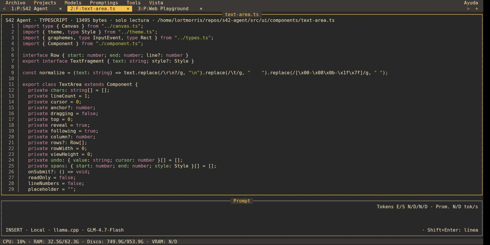

<h1 align="center">S42 Agent</h1>

<p align="center">
  <strong>Un agente de coding con alma de QBasic.</strong><br>
  TypeScript + Bun · Modelos locales · MCP y skills · TUI + CLI
</p>

<p align="center">
  <a href="docs/releases/v0.1.1.es.md"></a>
  <a href="https://bun.sh/"></a>
  <a href="https://www.typescriptlang.org/"></a>
  <a href="LICENSE"></a>
  <a href="package.json"></a>
</p>

<p align="center">
  
</p>

<p align="center"><sub>Portada comercial ilustrada. Las capturas de la TUI en ejecución están más abajo.</sub></p>

<p align="center">
  <a href="README.md">English</a> · <strong>Español</strong><br>
  <a href="#instalación">Instalar</a> ·
  <a href="#ejecutar-desde-código-fuente">Ejecutar desde fuente</a> ·
  <a href="#capturas-reales">Capturas reales</a> ·
  <a href="docs/USAGE.es.md">Manual de uso</a> ·
  <a href="CONTRIBUTING.es.md">Contribuir</a> ·
  <a href="https://github.com/stock42/s42-agent/discussions">Comunidad</a>
</p>

---

## Qué tiene de especial

El escritorio clásico de QBasic llevado al coding con IA: menús, ventanas con
título, navegación por teclado y un prompt siempre visible mientras el agente
trabaja. Cada proyecto conserva su conversación, archivos, modelo y herramientas.

- **TUI estilo QBasic:** mouse, ventanas auxiliares movibles y atajos inspirados en Vim.
- **Varios proyectos a la vez:** sesiones y borradores independientes, actividad visible en cada pestaña.
- **Explorador de archivos:** cualquier carpeta, búsqueda por nombre/glob, adjuntos y colores para HTML/CSS/JS/TS con números de línea. El chat también tiene un margen numerado.
- **Tareas y verificación:** tablero TODO.md, resultados de pruebas en vivo y evidencia por tarea.
- **Git e instrucciones:** diff/historial de solo lectura, inicialización Git explícita y preview editable de AGENTS.md. El cierre registra changelog y commit según las reglas del proyecto.
- **Pruebas Chrome:** conexión opcional Chrome DevTools MCP por proyecto, con DOM, consola, red y capturas conservadas. Requiere servidor/runtime externo y Chrome.
- **Preview web:** Tools → WebServer sirve el proyecto con Bun, puerto configurable y apertura del navegador.
- **Modelos locales y remotos:** llama.cpp por defecto, DeepSeek precargado y endpoints compatibles.
- **17 herramientas nativas:** archivos, HTTP, comandos, Markdown, WebSocket, scraping, historial y planificación/verificación/cierre de tareas.
- **MCP y skills:** servidores stdio/HTTP, enabled/disabled, guías internas, skills externas y búsqueda en skills.sh.
- **Biblioteca de promptings:** plantillas con `{{metavariables}}` y formulario para completar sus valores.
- **Español o inglés y seis temas:** QBasic, Grafito, Bosque, Nord, Dracula y Gruvbox.
- **Actividad visible:** streaming, tools, tokens de entrada/salida y promedio tok/s; indicadores CPU/RAM/disco/VRAM configurables.
- **SQLite y llavero del SO:** configuración global e historial persistentes; las API keys se guardan aparte.
- **CLI sin TUI:** el mismo agente para pruebas y automatizaciones desde la command line.

El harness no tiene dependencias externas de paquetes de runtime. El servidor
LLM, sus modelos y los programas usados por shell/MCP se configuran aparte.

## Instalación

Usá un terminal ANSI de al menos **60×16** celdas; se recomienda 80×24 o más.
El agente compilado incluye el runtime de Bun: podés instalarlo y ejecutarlo
sin instalar Bun por separado. El servidor/modelo LLM y los programas externos
usados por shell/MCP se configuran aparte.
[Ejecutables independientes de Bun](https://bun.com/docs/bundler/executables).

> **[Prerelease v0.1.1](https://github.com/stock42/s42-agent/releases/tag/v0.1.1):**
> incluye seis binarios y un paquete para todas las plataformas. Los comandos de
> descarga de un paso requieren assets públicos. Si el repositorio es privado,
> descargá el paquete con acceso GitHub autorizado, extraelo y usá el instalador local.
> [Preparar la release](docs/PUBLISHING.es.md).

### Linux · un comando

```bash
curl -fsSL https://raw.githubusercontent.com/stock42/s42-agent/main/install.sh | bash
```

### macOS · un comando

```bash
curl -fsSL https://raw.githubusercontent.com/stock42/s42-agent/main/install.sh | bash
```

### Windows · un comando en PowerShell

```powershell
powershell -c "irm https://raw.githubusercontent.com/stock42/s42-agent/main/install.ps1|iex"
```

Los instaladores [Bash](install.sh) y [PowerShell](install.ps1) detectan
x64/ARM64, comprueban SHA-256 e instalan para tu usuario,
sin permisos de administrador. Linux/macOS usan `~/.local/bin`; Windows usa
`%LOCALAPPDATA%\S42Agent\bin`. Agrega la carpeta al perfil de tu shell o al
PATH del usuario en Windows. Abrí otro terminal y ejecutá:

```text
s42-agent
```

Archivos publicados en la release. Linux x64 tiene validación de ejecución
local; los otros cinco destinos cuentan con cross-builds:

| Plataforma | Arquitectura | Binario |
| --- | --- | --- |
| Linux (glibc) | x64 | `s42-agent-0.1.1-linux-x64` |
| Linux (glibc) | ARM64 | `s42-agent-0.1.1-linux-arm64` |
| macOS | Intel x64 | `s42-agent-0.1.1-darwin-x64` |
| macOS | Apple Silicon ARM64 | `s42-agent-0.1.1-darwin-arm64` |
| Windows | x64 | `s42-agent-0.1.1-windows-x64.exe` |
| Windows | ARM64 | `s42-agent-0.1.1-windows-arm64.exe` |

Disponibles en [GitHub Releases](https://github.com/stock42/s42-agent/releases/tag/v0.1.1).
Los ejecutables se acompañan de `SHASUMS256.txt`.
Windows requiere Windows 10 1809 o posterior; macOS requiere 13 o posterior.
Los binarios Linux usan glibc; Alpine/musl requiere otro target.
[Requisitos de Bun por plataforma](https://bun.com/docs/installation).

Después de extraer el paquete conjunto de la release, instalá desde su carpeta:

```bash
# Linux o macOS
bash install.sh --from-dir .
```

```powershell
# Windows PowerShell
powershell -NoProfile -ExecutionPolicy Bypass -File .\install.ps1 -FromDirectory .
```

Desde un clon que tenga los archivos generados en `dist/`, la instalación local
también es un comando:

```bash
# Linux o macOS
bash install.sh --from-dir ./dist
```

```powershell
# Windows PowerShell
powershell -NoProfile -ExecutionPolicy Bypass -File .\install.ps1 -FromDirectory .\dist
```

Opciones: `--version`, `--install-dir`, `--no-modify-path` en Linux/macOS;
`-Version`, `-InstallDir`, `-NoModifyPath` en Windows. Para actualizar, usá el
mismo instalador. Borrar el ejecutable no elimina la configuración ni el historial.

## Ejecutar desde código fuente

**Necesitás Git y Bun 1.4.2 para clonar, ejecutar la fuente o generar binarios.**
No hace falta Node.js ni npm. Instalá [Bun](https://bun.sh/) con su comando oficial:

### Instalar Bun en Linux o macOS

Linux requiere `curl` y `unzip` (Debian/Ubuntu: `sudo apt install curl unzip`).

```bash
curl -fsSL https://bun.sh/install | bash
```

### Instalar Bun en Windows

```powershell
powershell -c "irm bun.sh/install.ps1|iex"
```

Abrí otro terminal y ejecutá `bun --version`. El proyecto usa **Bun 1.4.2**.
Si no encuentra el comando, agregá `~/.bun/bin` (Linux/macOS) o
`%USERPROFILE%\.bun\bin` (Windows) al PATH.
[Guía oficial de instalación](https://bun.sh/docs/installation).

<details>
<summary>Instalar la versión exacta del proyecto: Bun 1.4.2</summary>

Linux o macOS:

```bash
curl -fsSL https://bun.sh/install | bash -s -- bun-v1.4.2
```

Windows PowerShell:

```powershell
iex "& {$(irm https://bun.sh/install.ps1)} -Version 1.4.2"
```

</details>

### Clonar e iniciar

Los mismos comandos sirven en Linux/macOS y en PowerShell de Windows:

```bash
git clone https://github.com/stock42/s42-agent.git
cd s42-agent
bun install --frozen-lockfile
bun run dev
```

### Compilar todas las plataformas

```bash
bun run build:release
```

Bun genera los seis ejecutables en `dist/`, checksums `SHASUMS256.txt`,
metadatos, instaladores y el paquete conjunto
`s42-agent-0.1.1-all-platforms.tar.gz`. Cross-compilar no prueba la ejecución
en el SO de destino. Los archivos generados quedan fuera de Git y se suben
a una release por separado. [Preparación de la release](docs/PUBLISHING.es.md).

`bun run build` compila solo para el host; `bun run build:targets` genera los
seis ejecutables y el manifiesto sin el paquete de entrega.

## Primer inicio

1. **Projects → Agregar proyecto:** Nombre/Name y Carpeta/Folder.
2. **Models → Proveedores:** configurá llama.cpp, DeepSeek u otro endpoint;
   consultá el catálogo y elegí el modelo.
3. Escribí en **Prompt**. **Enter** envía; **Shift+Enter** agrega una línea.
4. Seguí la respuesta y las tools en el chat. **Ctrl+C** cancela el turno activo.

El modelo y la configuración se recuerdan aunque abras el agente desde otra
carpeta. **Vista → Language** cambia el idioma; **Vista → Paleta de colores**
cambia el tema.

### Modelo local

Iniciá tu servidor llama.cpp con un GGUF disponible:

```bash
llama-server -m /ruta/modelo.gguf --host 127.0.0.1 --port 8080 --alias local-coder --jinja
```

Elegí `local-coder` en Models. Para usar herramientas, el modelo y su template
deben soportar tool calling. El agente descubre capacidades mediante `/props`.

### Sin interfaz

Con el binario instalado, reemplazá `bun run index.ts` por `s42-agent`.

```bash
bun run index.ts \
  --cwd /ruta/proyecto \
  --llm_server http://127.0.0.1 \
  --llm_port 8080 \
  --prompting "Desarrollá un Tetris en un solo archivo HTML con sonido" \
  --reasoning off
```

También acepta `--model`, `--llm_apikey` y `--session`. La respuesta llega por
stdout; tools, errores, ID de sesión y uso por stderr. `--reasoning` controla
la visibilidad del razonamiento emitido por el proveedor. Todos los argumentos:
`bun run index.ts --help`.

### Probar un proyecto web

En **Tools → WebServer**, elegí el puerto (inicial `3000`) y **Iniciar**, o
presioná Enter en el campo. Sirve la carpeta del proyecto activo en
`http://127.0.0.1:PUERTO/` y abre el navegador predeterminado. Si estás viendo un
archivo dentro del proyecto, lo abre directamente; si no, abre `index.html` o
un listado de archivos. HTML, CSS, JavaScript, imágenes y otros archivos
estáticos conservan su tipo MIME. Refrescá el navegador para ver cambios.

El mismo menú permite **Detener** y **Abrir navegador**. Podés tener un servidor
por proyecto en distintos puertos. Cerrar el diálogo lo deja funcionando; cerrar
la pestaña del proyecto o salir del agente lo detiene. Es una preview estática,
sin bundler ni backend de aplicación.

## Capturas reales

<a href="screenshots/32-spanish-gruvbox.jpg"></a>

Un recorrido por el agente en ejecución. Cada imagen abre el original; las **41 capturas** están en la [galería completa](screenshots/README.es.md).

<table>
  <tr>
    <td><a href="screenshots/10-live-tool-chat.jpg"></a><br><strong>Modelo real, tools y métricas de tokens</strong></td>
    <td><a href="screenshots/14-project-explorer.jpg"></a><br><strong>Explorador y búsqueda de archivos</strong></td>
  </tr>
  <tr>
    <td><a href="screenshots/12-prompting-variables.jpg"></a><br><strong>Promptings con {{metavariables}}</strong></td>
    <td><a href="screenshots/09-provider-presets.jpg"></a><br><strong>llama.cpp y DeepSeek precargados</strong></td>
  </tr>
  <tr>
    <td><a href="screenshots/06-webserver.jpg"></a><br><strong>WebServer del proyecto</strong></td>
    <td><a href="screenshots/27-skills-search-results.jpg"></a><br><strong>Resultados reales de skills.sh</strong></td>
  </tr>
</table>

Las plantillas y Web Playground son ejemplos para las capturas. El chat usa un modelo local real; las imágenes del WebServer provienen de su QA en navegador.

<details>
<summary>Ver las seis paletas</summary>

<table>
  <tr>
    <td><a href="screenshots/16-qbasic-typescript.jpg"></a><br><strong>QBasic</strong></td>
    <td><a href="screenshots/17-graphite-typescript.jpg"></a><br><strong>Graphite</strong></td>
  </tr>
  <tr>
    <td><a href="screenshots/18-forest-typescript.jpg"></a><br><strong>Forest</strong></td>
    <td><a href="screenshots/19-nord-typescript.jpg"></a><br><strong>Nord</strong></td>
  </tr>
  <tr>
    <td><a href="screenshots/20-dracula-typescript.jpg"></a><br><strong>Dracula</strong></td>
    <td><a href="screenshots/21-gruvbox-typescript.jpg"></a><br><strong>Gruvbox</strong></td>
  </tr>
</table>

</details>

## Herramientas

| Capacidad | Tools nativas |
| --- | --- |
| Leer, escribir, editar y listar archivos | `read`, `write`, `edit`, `list` |
| Buscar archivos y contenido | `find`, `search` |
| HTTP y comandos del sistema | `fetch`, `shell` |
| Instrucciones internas y Markdown → HTML | `internal_skill`, `markdown_html` |
| WebSocket y scraping de páginas renderizadas | `websocket`, `scrape` |
| Historial y flujo de tareas | `session_history`, `task_plan`, `task_update`, `task_verify`, `task_closeout` |

Usan APIs de Bun: Shell, Markdown, WebSocket y WebView, entre otras. Las
herramientas tienen los permisos de tu usuario y efectos reales; no hay sandbox.
El agente lee las instrucciones AGENTS.md del proyecto.

**Tools → MCP** administra servidores de herramientas stdio/HTTP. **Tools → Skills**
administra guías y busca en [skills.sh](https://skills.sh). Las guías internas
incluidas cubren estructura de proyectos, debugging/verificación y flujos PDF. Scraping requiere
un navegador instalado en Linux/Windows; crear PDF requiere un renderizador.
MCP implementa tools; resources/prompts, OAuth, sampling y elicitation no están
implementados. [Contratos de herramientas](docs/TOOLS.es.md).

## Teclado, idioma y paletas

| Acción | Atajo |
| --- | --- |
| Enviar / nueva línea | Enter / Shift+Enter |
| Cancelar proyecto activo / salir | Ctrl+C / Ctrl+Q |
| Explorador / selector de proyecto | Ctrl+E / Ctrl+P |
| Pestaña anterior / siguiente | Alt+← / Alt+→ |
| Cerrar pestaña o auxiliar | Ctrl+W |
| Promptings / MCP / skills | Alt+T / Alt+C / Alt+S |
| Cambiar panel / foco | Ctrl+N / Tab |

Vim inicia en INSERT; Esc pasa a NORMAL. F1–F12 no tienen acciones asignadas.
Si el terminal no distingue Shift+Enter, usá Ctrl+J.

**Vista** (en inglés: **View**) cambia español/inglés y las seis paletas:
**QBasic, Graphite, Forest, Nord, Dracula y Gruvbox**. También controla visibilidad
del razonamiento e indicadores CPU/RAM/disco/VRAM. Tokens de entrada/salida y
promedio tok/s siguen visibles; contadores de proveedor/dispositivo no disponibles
muestran N/D.

## Estado y desarrollo

**v0.1.1 es una preview.** Linux x64 cuenta con validación local, PTY y modelo
real; el compilado actual también pasa el smoke fuera del checkout.
Los seis binarios actuales están preparados para la release. Faltan pruebas
de ejecución en Windows/macOS/ARM64 y cobertura física de mouse/drop.

```bash
bun run typecheck
bun test
bun run index.ts --demo   # Laboratorio de componentes, sin persistencia de proyectos.
```

El build del host es opcional: `bun run build`. El binario contiene Bun,
pero el servidor LLM y los comandos externos siguen siendo independientes.

- [Manual completo](docs/USAGE.es.md)
- [Contratos de tools](docs/TOOLS.es.md)
- [Contribuir](CONTRIBUTING.es.md) y [changelog](CHANGELOG.md)
- [Preparar releases](docs/PUBLISHING.es.md) y [notas v0.1.1](docs/releases/v0.1.1.es.md)

## Autoría

Creado por [César Casas](https://www.linkedin.com/in/cesarcasas/) · Stock42.
**Building with Codex & GPT-6.1 Sol.**

Inspirado en la experiencia de QBasic y en [Pi](https://github.com/earendil-works/pi)
como referencia arquitectónica. S42 Agent es un proyecto independiente.

Contribuciones y reportes reproducibles son bienvenidos.
[CONTRIBUTING.es.md](CONTRIBUTING.es.md) · [MIT](LICENSE).
