<h1 align="center">S42 Agent</h1>

<p align="center">
  <strong>A coding agent with the soul of QBasic.</strong><br>
  TypeScript + Bun · Local LLMs · MCP &amp; skills · TUI + headless CLI
</p>

<p align="center">
  <a href="docs/releases/v0.1.0.md"></a>
  <a href="https://bun.sh/"></a>
  <a href="https://www.typescriptlang.org/"></a>
  <a href="LICENSE"></a>
  <a href="package.json"></a>
</p>

<p align="center">
  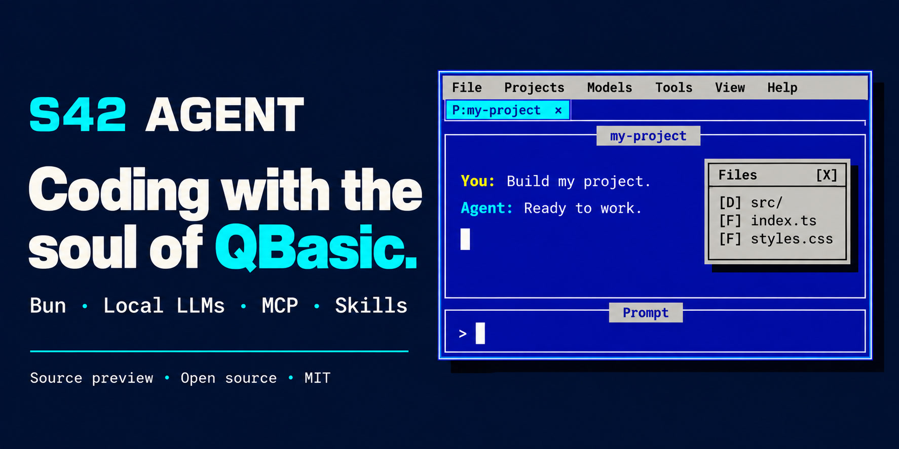
</p>

<p align="center"><sub>Commercial cover illustration. See the real running TUI in the screenshots below.</sub></p>

<p align="center">
  <strong>English</strong> · <a href="README.es.md">Español</a><br>
  <a href="#installation">Install</a> ·
  <a href="#run-from-source">Run from source</a> ·
  <a href="#screenshots">Real screenshots</a> ·
  <a href="docs/USAGE.md">User guide</a> ·
  <a href="CONTRIBUTING.md">Contribute</a>
</p>

---

## Why S42 Agent?

A familiar desktop made of terminal cells: classic menus, titled windows,
keyboard navigation and a prompt that stays visible while the agent works.
Choose your model, open a project and keep its conversation, files and tools
together.

- **QBasic-style TUI:** mouse, draggable auxiliary windows, menus and Vim-inspired shortcuts.
- **Multiple projects:** independent sessions, drafts and models; background activity in each tab.
- **Web preview:** Tools → WebServer serves the current project with Bun on a chosen port and opens your browser.
- **Files at hand:** browse any folder, search filenames/globs, attach files and read HTML/CSS/JS/TS with syntax colors and line numbers. Chats also have a numbered margin.
- **Local first:** llama.cpp is the default; DeepSeek and other Chat Completions-compatible providers are configurable.
- **12 native tools:** files, content search, HTTP, commands, Markdown, WebSocket and rendered-page scraping.
- **MCP and skills:** manage servers, enable/disable them, load internal or external skills and search skills.sh.
- **Reusable prompts:** a library with `{{variables}}` and a form to fill their values.
- **Your workspace:** Spanish/English, six themes, visible tool activity, token usage and average tok/s.
- **Persistence:** OS-specific global configuration and history in native SQLite; API keys in the OS keychain.
- **Headless CLI:** the same agent loop without the TUI.

The harness has **no external runtime package dependencies**. Your LLM server,
models and programs invoked by shell/MCP are separate.

## Installation

Use an ANSI terminal, at least **60×16** cells (80×24 or larger recommended).
The compiled agent includes the Bun runtime: you can install and run it without
installing Bun separately. Your LLM server/model and external shell/MCP programs
remain separate. [How Bun standalone executables work](https://bun.com/docs/bundler/executables).

> **[v0.1.0 prerelease](https://github.com/stock42/s42-agent/releases/tag/v0.1.0):**
> includes six binaries and an all-platforms package. The one-command downloads
> below require publicly accessible release assets. If the repository is private,
> download the package with authorized GitHub access, extract it and use the local installer below.
> [Release preparation](docs/PUBLISHING.md).

### Linux · one command

```bash
curl -fsSL https://raw.githubusercontent.com/stock42/s42-agent/main/install.sh | bash
```

### macOS · one command

```bash
curl -fsSL https://raw.githubusercontent.com/stock42/s42-agent/main/install.sh | bash
```

### Windows · one command in PowerShell

```powershell
powershell -c "irm https://raw.githubusercontent.com/stock42/s42-agent/main/install.ps1|iex"
```

The [Bash installer](install.sh) and [PowerShell installer](install.ps1) detect
x64/ARM64, check SHA-256 and install for your user,
without administrator access. Linux/macOS use `~/.local/bin`; Windows uses
`%LOCALAPPDATA%\S42Agent\bin`. It adds that directory to your shell profile or
Windows user PATH. Open a new terminal and run:

```text
s42-agent
```

Published release files are named as follows. Linux x64 has local runtime
validation, while the other five targets have cross-builds.

| Platform | Architecture | Binary |
| --- | --- | --- |
| Linux (glibc) | x64 | `s42-agent-0.1.0-linux-x64` |
| Linux (glibc) | ARM64 | `s42-agent-0.1.0-linux-arm64` |
| macOS | Intel x64 | `s42-agent-0.1.0-darwin-x64` |
| macOS | Apple Silicon ARM64 | `s42-agent-0.1.0-darwin-arm64` |
| Windows | x64 | `s42-agent-0.1.0-windows-x64.exe` |
| Windows | ARM64 | `s42-agent-0.1.0-windows-arm64.exe` |

Download from [GitHub Releases](https://github.com/stock42/s42-agent/releases/tag/v0.1.0).
`SHASUMS256.txt` accompanies the raw executables.
Windows requires Windows 10 1809 or later; macOS requires 13 or later.
Linux binaries target glibc, rather than Alpine/musl.
[Bun platform requirements](https://bun.com/docs/installation).

After extracting the combined release package, install from its folder:

```bash
# Linux or macOS
bash install.sh --from-dir .
```

```powershell
# Windows PowerShell
powershell -NoProfile -ExecutionPolicy Bypass -File .\install.ps1 -FromDirectory .
```

From a clone containing generated `dist/` files, install locally in one command:

```bash
# Linux or macOS
bash install.sh --from-dir ./dist
```

```powershell
# Windows PowerShell
powershell -NoProfile -ExecutionPolicy Bypass -File .\install.ps1 -FromDirectory .\dist
```

Optional installer flags: `--version`, `--install-dir`, `--no-modify-path` on
Linux/macOS; `-Version`, `-InstallDir`, `-NoModifyPath` on Windows.
Updating uses the same installer command. Removing the installed binary does
not remove your configuration or session history.

## Run from source

**Git and Bun 1.4.2 are required to clone and run the source or generate binaries.**
Node.js and npm are not required. Install [Bun](https://bun.sh/) with its
official one-command installer:

### Install Bun on Linux or macOS

Linux needs `curl` and `unzip` (Debian/Ubuntu: `sudo apt install curl unzip`).

```bash
curl -fsSL https://bun.sh/install | bash
```

### Install Bun on Windows

```powershell
powershell -c "irm bun.sh/install.ps1|iex"
```

Open a new terminal and run `bun --version`. The project uses **Bun 1.4.2**.
If Bun is not found, add `~/.bun/bin` (Linux/macOS) or
`%USERPROFILE%\.bun\bin` (Windows) to PATH.
[Official installation guide](https://bun.sh/docs/installation).

<details>
<summary>Install the exact project version: Bun 1.4.2</summary>

Linux or macOS:

```bash
curl -fsSL https://bun.sh/install | bash -s -- bun-v1.4.2
```

Windows PowerShell:

```powershell
iex "& {$(irm https://bun.sh/install.ps1)} -Version 1.4.2"
```

</details>

### Clone and start

These commands work in Linux/macOS shells and Windows PowerShell:

```bash
git clone https://github.com/stock42/s42-agent.git
cd s42-agent
bun install --frozen-lockfile
bun run dev
```

### Compile all platforms

```bash
bun run build:release
```

This uses Bun to compile all six targets and creates `dist/` with executables,
`SHASUMS256.txt`, build metadata, installers and a combined
`s42-agent-0.1.0-all-platforms.tar.gz` handoff bundle. Cross-compiling does not
test execution on the destination OS. Generated files stay out of Git and are
uploaded to a GitHub release separately. [Release preparation](docs/PUBLISHING.md).

For a host-only build, use `bun run build`. For the six executables and build
manifest without the release bundle, use `bun run build:targets`.

## First run

The UI starts in Spanish. **Vista → Language → English** switches its language.

1. Add a project from **Projects** using **Name + Folder**.
2. Open **Models → Providers** (Spanish: **Proveedores**). Configure llama.cpp,
   DeepSeek or your compatible endpoint, discover its models and select one.
3. Write in **Prompt**. **Enter** sends; **Shift+Enter** adds a line.
4. Follow the response and tool calls in the project's read-only chat.
   **Ctrl+C** cancels its active turn.

Configuration, selected models and history survive restarts and are shared
across launch directories. Each project tab retains its own session and model.

### Use a local model

Start your llama.cpp server separately, with a GGUF you already have:

```bash
llama-server -m /path/to/model.gguf --host 127.0.0.1 --port 8080 --alias local-coder --jinja
```

Choose `local-coder` in Models. Tool calling requires support in the model and
its chat template. S42 Agent discovers llama.cpp capabilities through `/props`.
See the [llama.cpp server documentation](https://github.com/ggml-org/llama.cpp/blob/master/tools/server/README.md).

### Run without the UI

For the installed binary, replace `bun run index.ts` with `s42-agent`.

```bash
bun run index.ts \
  --cwd /path/to/project \
  --llm_server http://127.0.0.1 \
  --llm_port 8080 \
  --prompting "Build a single-file HTML Tetris game with sound" \
  --reasoning off
```

Use `--model id` to select a specific model and `--llm_apikey` for a per-run
credential override. Answers stream to stdout; tools, errors, session ID and
usage go to stderr. `--reasoning` controls visibility of provider-emitted
reasoning, not how the model reasons. Run `bun run index.ts --help` for flags.

### Preview a web project

Open **Tools → WebServer**, choose a port (default `3000`) and select **Start**
or press Enter in the port field. It serves the active project folder at
`http://127.0.0.1:PORT/` and opens your default browser. An open file inside the
project is previewed directly; otherwise it opens `index.html` or a directory
listing. HTML, CSS, JavaScript, images and other static assets retain their MIME
types. Refresh the browser to see changes.

Use **Stop** or **Open browser** in the same menu. Each project can run a server
on a different port. Closing the dialog leaves it running; closing the project
tab or exiting the agent stops it. This is a static preview, without a bundler
or application backend.

## Screenshots

<a href="screenshots/16-qbasic-typescript.jpg">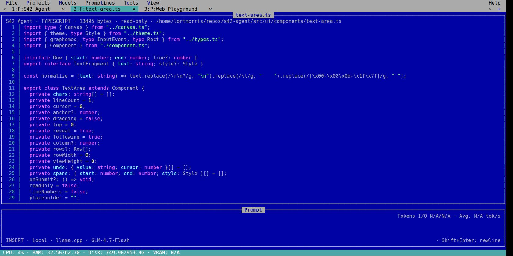</a>

A tour of the running agent. Click any image to open the original; see all **35 screenshots** in the [full gallery](screenshots/README.md).

<table>
  <tr>
    <td><a href="screenshots/10-live-tool-chat.jpg">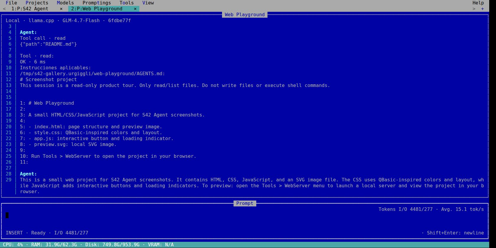</a><br><strong>Live model, tool calls and token metrics</strong></td>
    <td><a href="screenshots/14-project-explorer.jpg">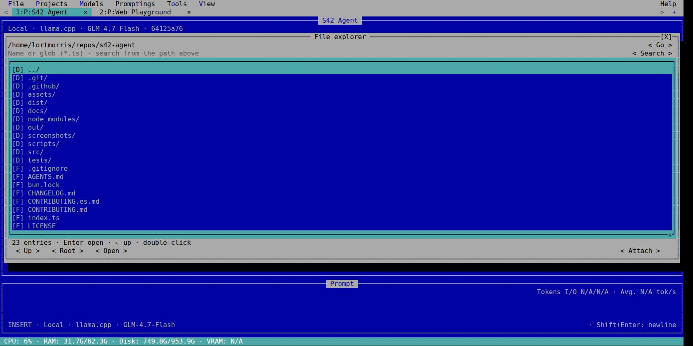</a><br><strong>Browse and search project files</strong></td>
  </tr>
  <tr>
    <td><a href="screenshots/12-prompting-variables.jpg">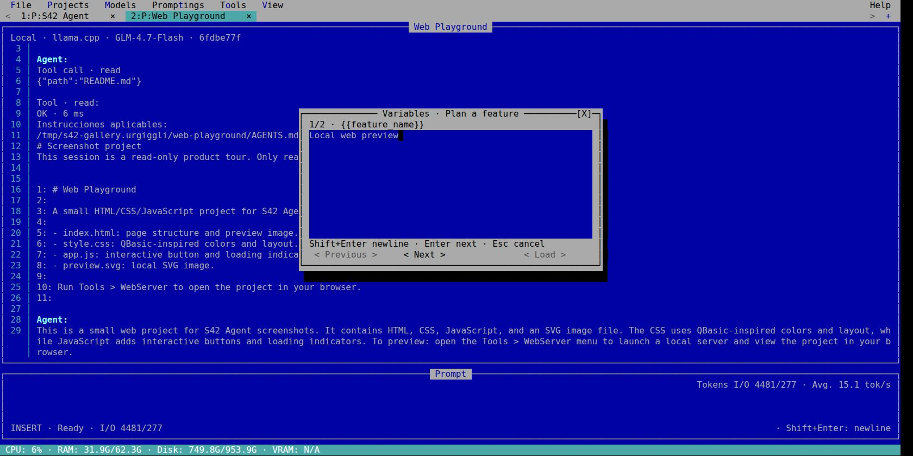</a><br><strong>Reusable prompts with {{variables}}</strong></td>
    <td><a href="screenshots/09-provider-presets.jpg">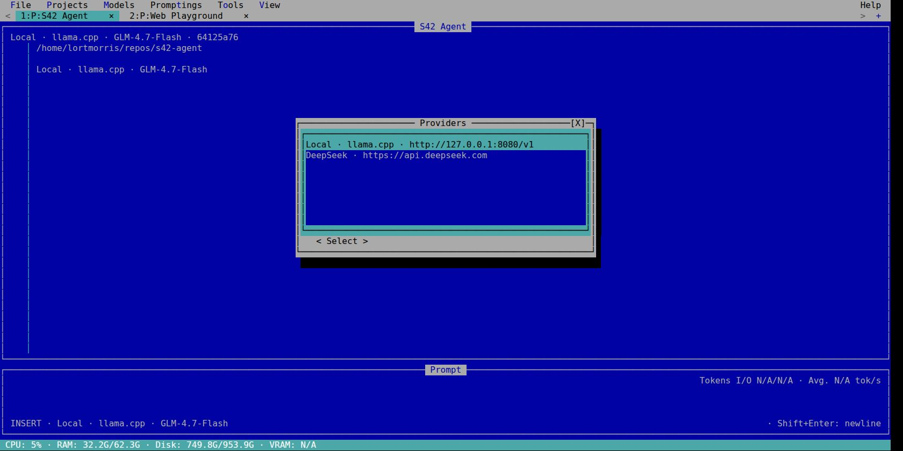</a><br><strong>llama.cpp and DeepSeek presets</strong></td>
  </tr>
  <tr>
    <td><a href="screenshots/06-webserver.jpg"></a><br><strong>Start a project WebServer</strong></td>
    <td><a href="screenshots/27-skills-search-results.jpg">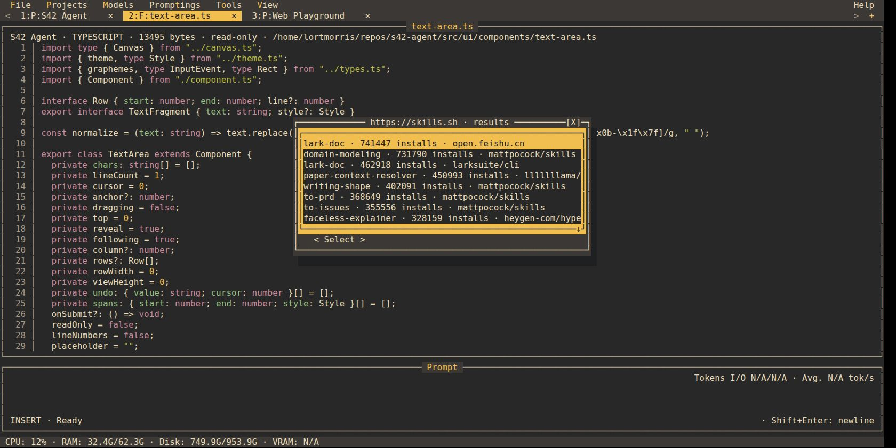</a><br><strong>Search the live skills.sh catalog</strong></td>
  </tr>
</table>

The prompt templates and Web Playground are tour examples. The chat uses a real local model; the WebServer images come from its recorded browser QA.

<details>
<summary>See all six themes</summary>

<table>
  <tr>
    <td><a href="screenshots/16-qbasic-typescript.jpg"></a><br><strong>QBasic</strong></td>
    <td><a href="screenshots/17-graphite-typescript.jpg">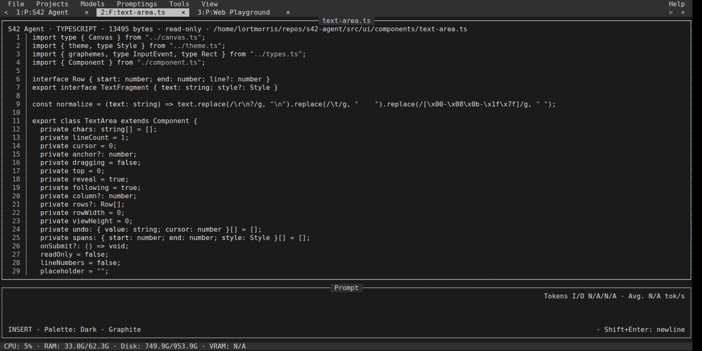</a><br><strong>Graphite</strong></td>
  </tr>
  <tr>
    <td><a href="screenshots/18-forest-typescript.jpg">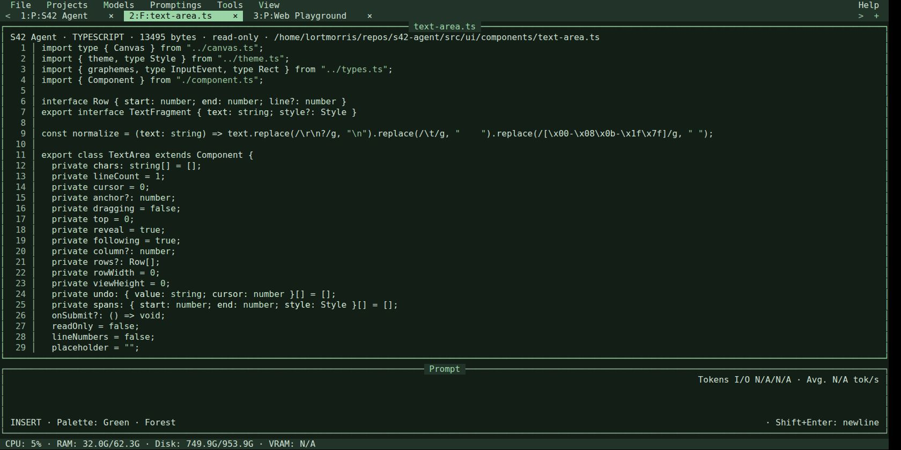</a><br><strong>Forest</strong></td>
    <td><a href="screenshots/19-nord-typescript.jpg">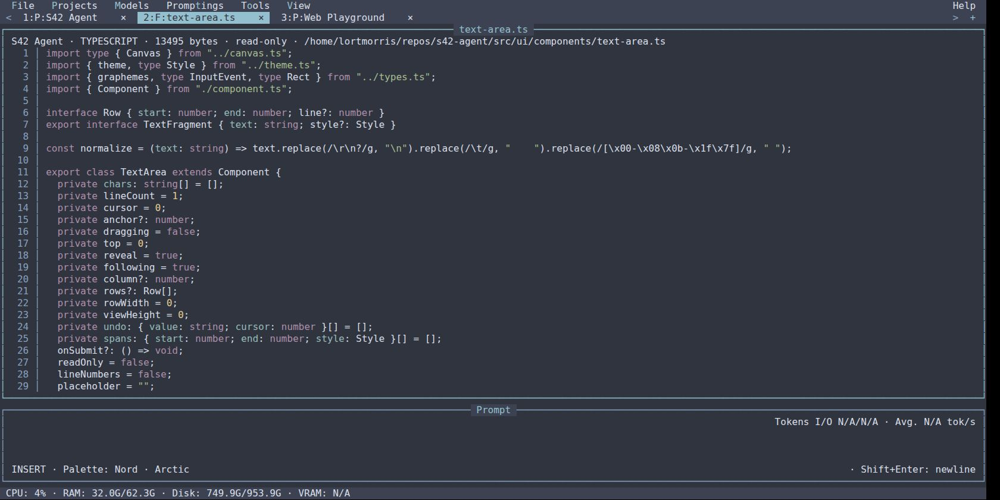</a><br><strong>Nord</strong></td>
  </tr>
  <tr>
    <td><a href="screenshots/20-dracula-typescript.jpg">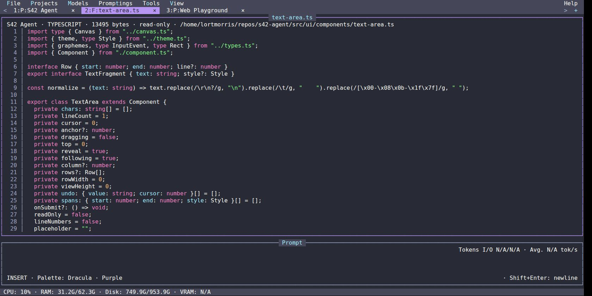</a><br><strong>Dracula</strong></td>
    <td><a href="screenshots/21-gruvbox-typescript.jpg">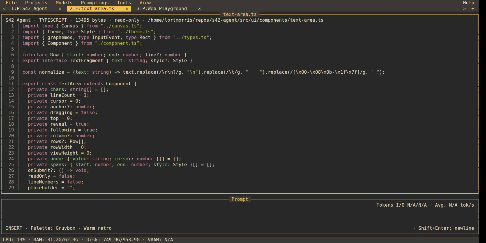</a><br><strong>Gruvbox</strong></td>
  </tr>
</table>

</details>

## Tools and extensions

| Capability | Native tools |
| --- | --- |
| Read, write, edit and list files | `read`, `write`, `edit`, `list` |
| Find files and search contents | `find`, `search` |
| HTTP and system commands | `fetch`, `shell` |
| Internal instructions and Markdown → HTML | `internal_skill`, `markdown_html` |
| WebSocket and rendered-page scraping | `websocket`, `scrape` |

These tools use Bun's APIs, including Bun Shell, Markdown, WebSocket and WebView.
The agent follows project AGENTS.md instructions. Tools run with your user's
permissions and have real filesystem/network/process effects; there is no sandbox.

**Tools → MCP** manages stdio/HTTP tool servers. **Tools → Skills** manages skills
and searches [skills.sh](https://skills.sh). Included internal guides cover
software project structure, debugging/verification and PDF workflows.
Scraping needs an installed browser on Linux/Windows; PDF generation needs an
installed renderer. MCP implements tools; resources/prompts, OAuth, sampling and
elicitation are not implemented. [Contracts and limits](docs/TOOLS.md).

## Keyboard, language and themes

| Action | Shortcut |
| --- | --- |
| Send / new line | Enter / Shift+Enter |
| Cancel current project / exit | Ctrl+C / Ctrl+Q |
| File explorer / project selector | Ctrl+E / Ctrl+P |
| Previous / next tab | Alt+← / Alt+→ |
| Close tab or auxiliary window | Ctrl+W |
| Promptings / MCP / skills | Alt+T / Alt+C / Alt+S |
| Change panel / focus | Ctrl+N / Tab |

Vim starts in INSERT; Esc enters NORMAL. Function keys F1–F12 are unassigned.
If your terminal cannot distinguish Shift+Enter, use Ctrl+J.

**View** (Spanish: **Vista**) switches Spanish/English and the six palettes:
**QBasic, Graphite, Forest, Nord, Dracula and Gruvbox**. It also controls reasoning
visibility and CPU/RAM/disk/VRAM indicators. Input/output tokens and average tok/s
remain visible; unavailable provider or device counters show N/A.

## Status and development

**v0.1.0 is a preview.** Linux x64 has local source, PTY and real-model validation;
the current compiled binary also passes a smoke test outside the checkout.
Six current binaries are prepared for release. Execution on Windows, macOS and
ARM64, and physical terminal mouse/drop coverage, remain pending.

```bash
bun run typecheck
bun test
bun run index.ts --demo   # Component laboratory, without project persistence.
```

An optional `bun run build` creates a host binary. The compiled harness includes
Bun; the LLM and external commands remain separate.

- [Detailed user guide](docs/USAGE.md)
- [Tool contracts](docs/TOOLS.md)
- [Contributing](CONTRIBUTING.md) and [changelog](CHANGELOG.md)
- [Release preparation](docs/PUBLISHING.md) and [release notes](docs/releases/v0.1.0.md)

## Credits

Created by [César Casas](https://www.linkedin.com/in/cesarcasas/) · Stock42.
**Building with Codex & GPT-6.1 Sol.**

Inspired by QBasic's terminal experience and [Pi](https://github.com/earendil-works/pi)
as an architectural reference. S42 Agent is an independent project.

Contributions and reproducible bug reports are welcome.
See [CONTRIBUTING.md](CONTRIBUTING.md). Licensed under [MIT](LICENSE).
