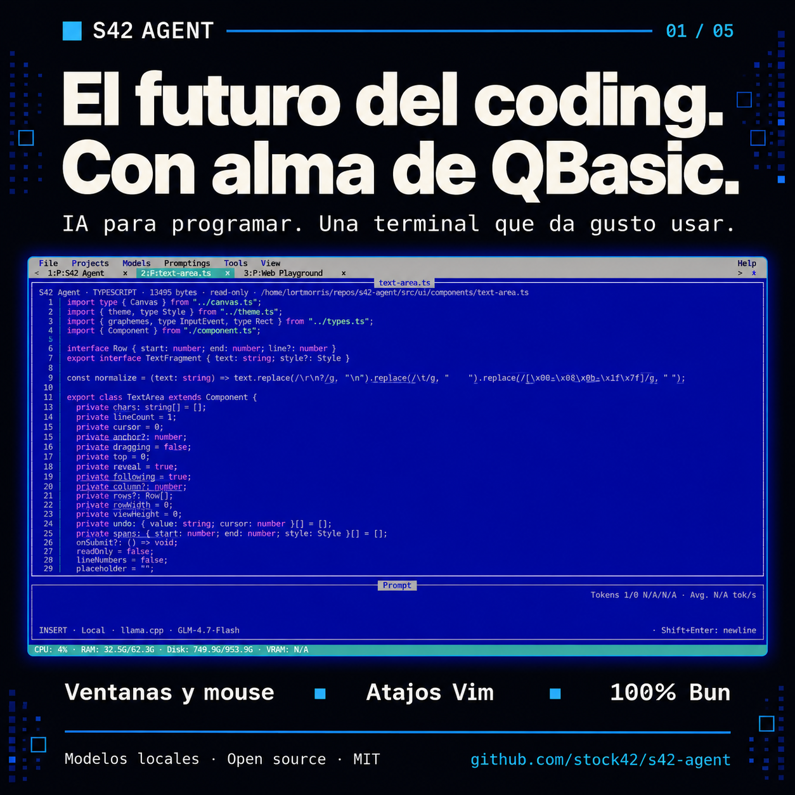
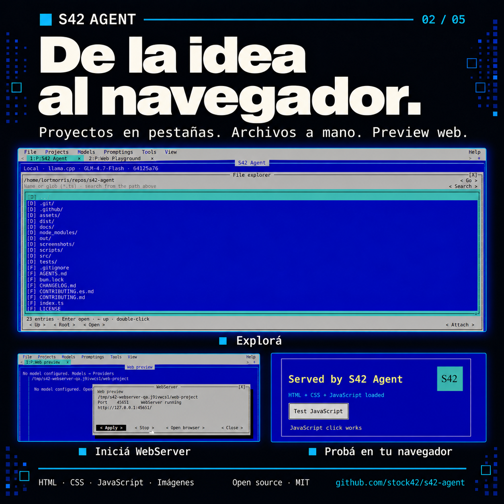
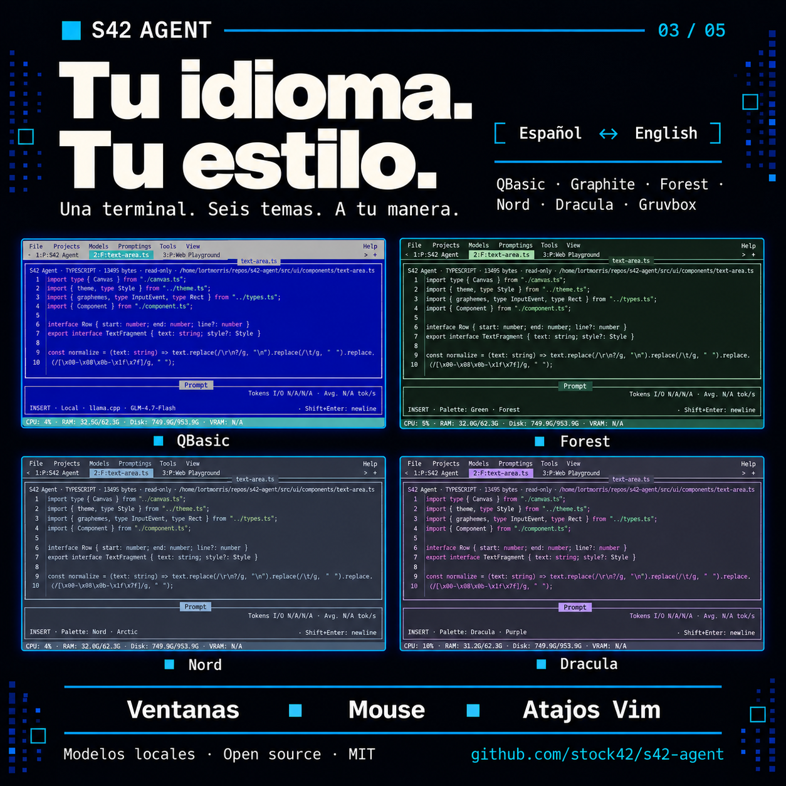
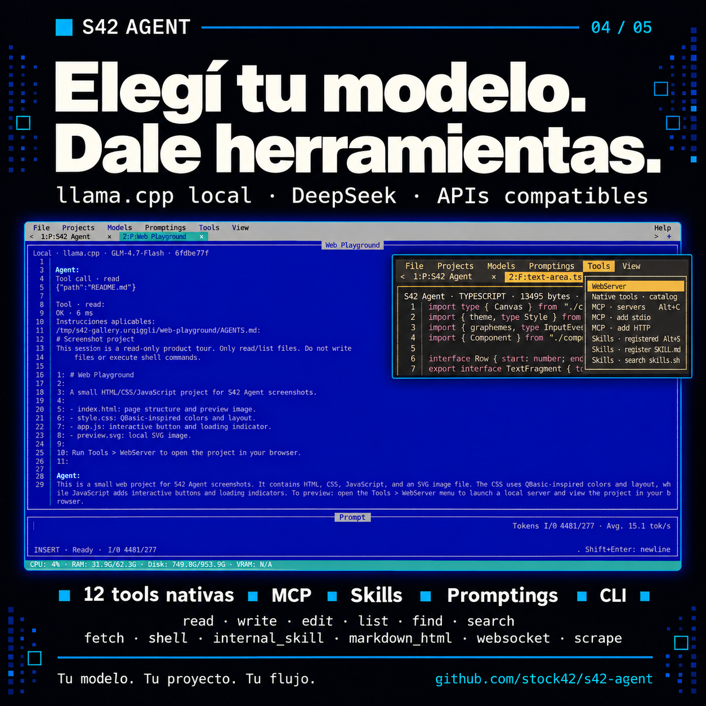
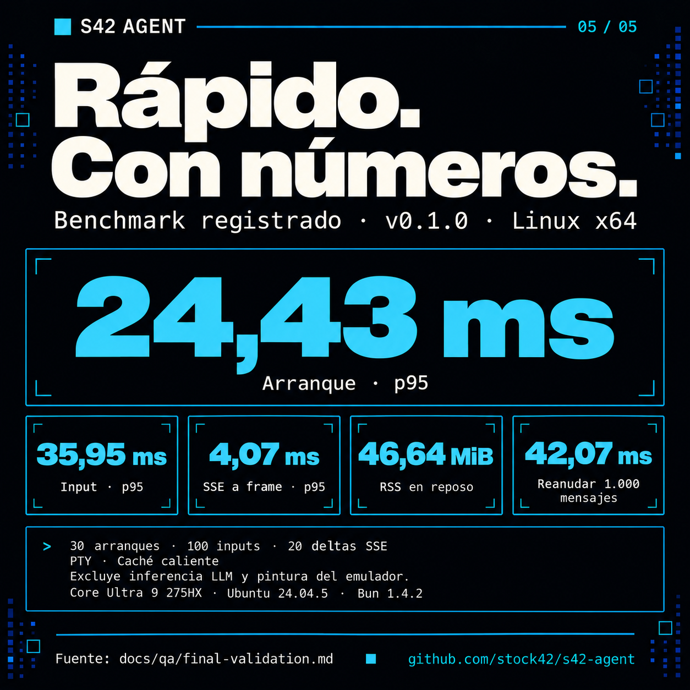

# S42 Agent · Real TUI campaign

Five stories, in Spanish and English, generated with `image_gen` using the final
[real screenshot gallery](../../../screenshots/README.md) as the visual reference.
Each series follows the same order: QBasic, projects/web preview, languages/themes,
models/tools, and the recorded benchmark.

These are AI-generated commercial compositions. The terminal inserts are
rendered from screenshot references; they are not untouched screenshot pixels or
new runtime evidence. Original JPEG captures remain unchanged in `screenshots/`.
Advertising copy is localized; captured code, messages and UI text retain their
source language.

[Español: imágenes y captions](es/README.md) · [English: images and captions](en/README.md)

<table>
  <tr><th>Español</th><th>English</th></tr>
  <tr>
    <td></td>
    <td></td>
  </tr>
  <tr>
    <td></td>
    <td></td>
  </tr>
  <tr>
    <td></td>
    <td></td>
  </tr>
  <tr>
    <td></td>
    <td></td>
  </tr>
  <tr>
    <td></td>
    <td></td>
  </tr>
</table>

## Sources and reuse

- [Final prompts and reference paths](prompts.json).
- [Image dimensions, hashes and source provenance](manifest.json).
- [Visual and asset validation](../../../docs/qa/real-tui-launch-campaign.md).
- [Historical benchmark methodology](../../../docs/qa/final-validation.md) and
  [raw measurements](../../../docs/qa/benchmark-s42-agent-0.1.0-linux-x64.json).
- Previous campaigns remain archived in
  [Spanish](../s42-agent-launch-2026-10-01/README.md) and
  [English](../s42-agent-launch-2026-10-01-en/README.md).

The benchmark describes the recorded v0.1.0 Linux x64 binary with warm OS cache and
PTY byte reception. It excludes LLM inference and graphical emulator painting.
No new performance measurement is implied by these posters.

The theme poster shows four referenced captures (QBasic, Forest, Nord and Dracula)
and lists all six available themes, including Graphite and Gruvbox.
