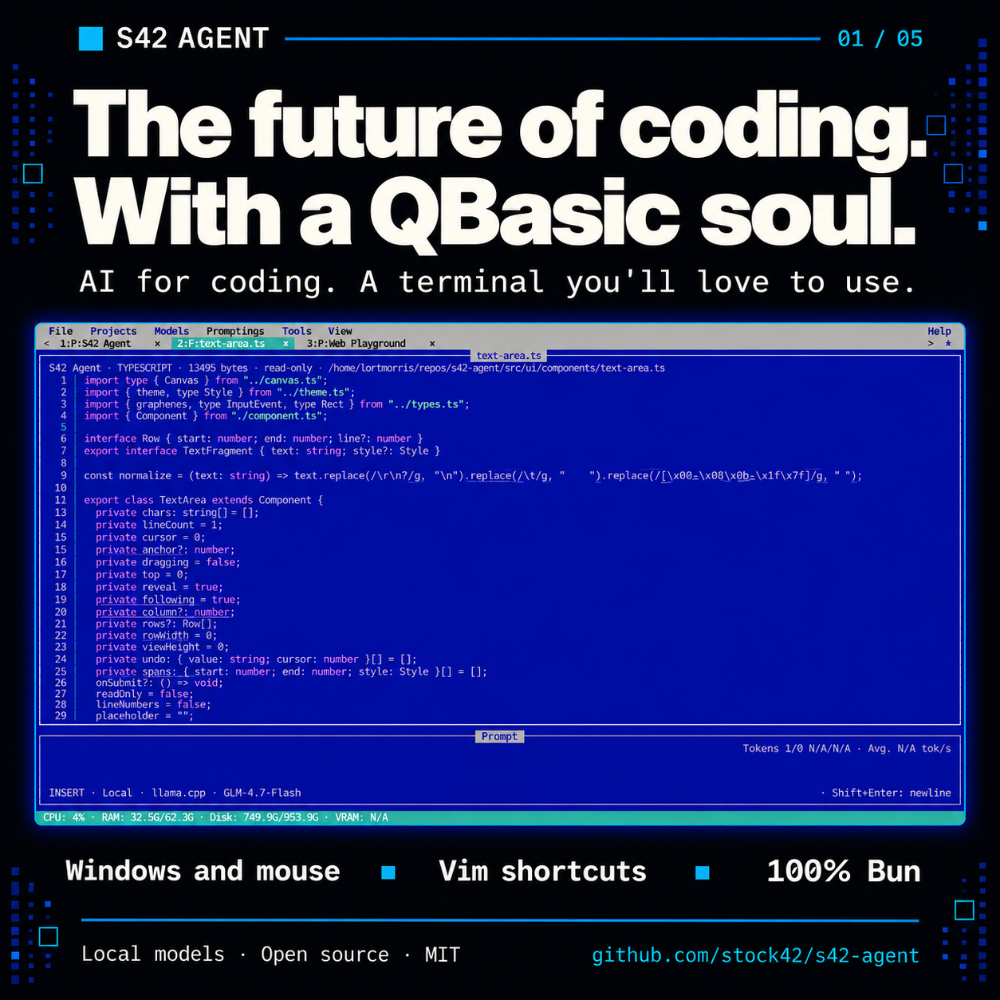
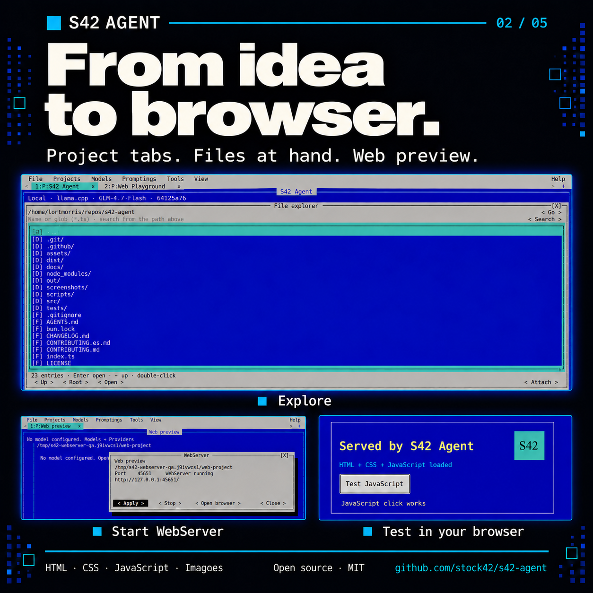
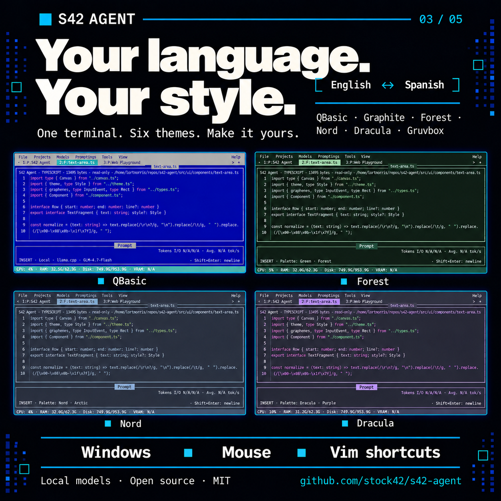
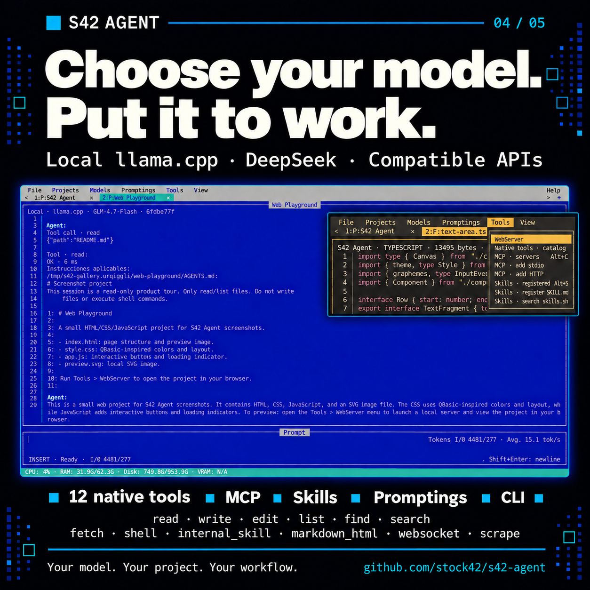
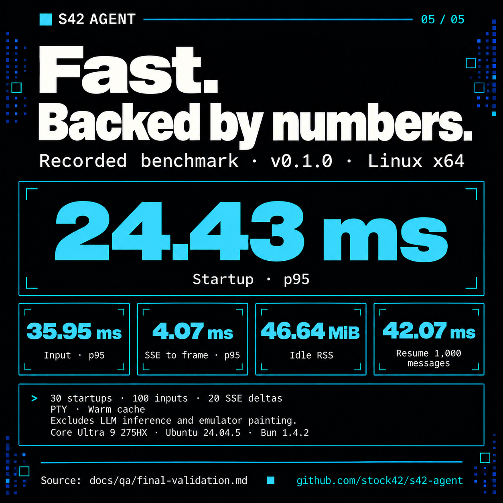

# S42 Agent · English campaign

Five commercial pieces generated with `image_gen` from the final screenshot
references. [Both series and provenance](../README.md) ·
[Original captures](../../../../screenshots/README.md).

## 1. The future of coding. With a QBasic soul.

**Caption:** AI for coding in a terminal with windows, mouse support and
Vim-inspired shortcuts. Local models, TypeScript and Bun. Open source under MIT.

## 2. From idea to browser.

**Caption:** Project tabs, a file explorer and web preview.
Tools → WebServer serves the project folder and opens your browser to test
HTML, CSS, JavaScript and images.

## 3. Your language. Your style.

**Caption:** English or Spanish. Six themes: QBasic, Graphite, Forest, Nord,
Dracula and Gruvbox. Choose your workspace from View.

## 4. Choose your model. Put it to work.

**Caption:** Local llama.cpp, DeepSeek and compatible APIs. Twelve native tools
for files, search, HTTP, commands and more. Add MCP, skills and promptings;
use the same agent from the headless CLI.

## 5. Fast. Backed by numbers.

**Caption:** Recorded v0.1.0 Linux x64 benchmark: startup p95
24.43 ms; input p95 35.95 ms; SSE to frame p95 4.07 ms; idle RSS
46.64 MiB; resume 1,000 messages 42.07 ms. Warm cache and received PTY bytes,
excluding LLM inference and emulator painting.
[Methodology and record](../../../../docs/qa/final-validation.md).

Repository: [stock42/s42-agent](https://github.com/stock42/s42-agent).
