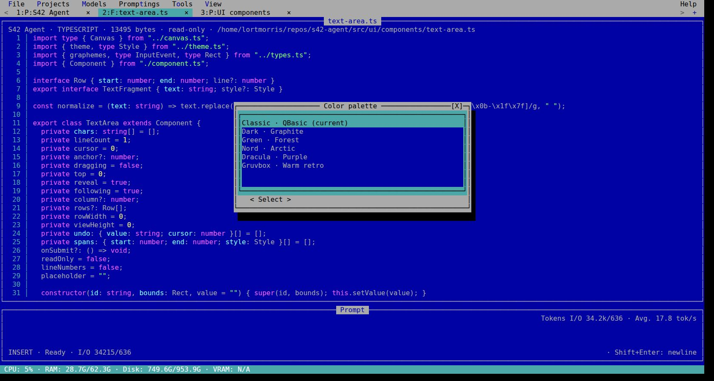
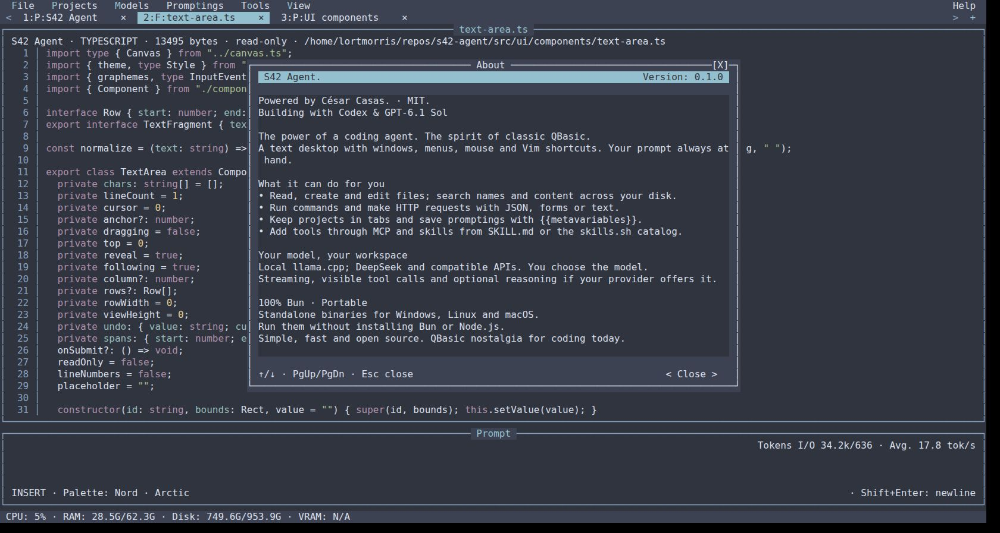

# S42 Agent — real TUI screenshots

Captured on 2026-10-01 from the actual root `index.ts`, running with Bun 1.4.2
in a **Bun.Terminal PTY**. [xterm.js](https://xtermjs.org/) 6.0.0 and its fit addon
0.11.0 displayed the process's ANSI output in Chrome. The viewer forwards
keyboard/mouse input to that process. It does not draw S42 windows or recreate
the UI. JPEG files are the unmodified browser viewport captures, **1680×897 px**.
These are terminal-emulator screenshots, not native desktop-window captures.

The run used a temporary SQLite configuration with English UI, two registered
project directories from this repository, and a live local llama.cpp endpoint
with **GLM-4.7-Flash**. Chat replies came from that model. Files, windows, menus,
themes, line numbers and telemetry came from S42 Agent. No model fixtures,
AI-generated pixels, layout overlays or invented tool output were used.

| Capture | What it shows |
| --- | --- |
| [01 — Chat](01-qbasic-chat.jpg) | QBasic, a live local-model conversation, separate user/agent labels, logical line numbers and token metrics. |
| [02 — Explorer](02-file-explorer.jpg) | The actual repository listing, editable path, disk filename/glob search and navigation/attachment controls. |
| [03 — TypeScript](03-typescript-file.jpg) | `text-area.ts` opened in a read-only F: tab, P: project tabs, real syntax colors and source line numbers. |
| [04 — Themes](04-color-themes.jpg) | The existing six-theme selector above the live file view. |
| [05 — About / Nord](05-about-nord.jpg) | The real About window after applying Nord, with capabilities and author/model credits. |

Use these files as product references for launch material. Earlier campaign
illustrations remain separate in `assets/banners/` and `assets/github/`.
Visible token rates and system resources describe this specific run; they are
not benchmark results. These captures do not validate Windows/macOS runtimes
or physical desktop drag-and-drop.

Capture hashes and provenance are recorded in [manifest.json](manifest.json).
Feature validation is recorded in
[line-number and screenshot QA](../../../docs/qa/line-numbers-and-real-screenshots.md).
