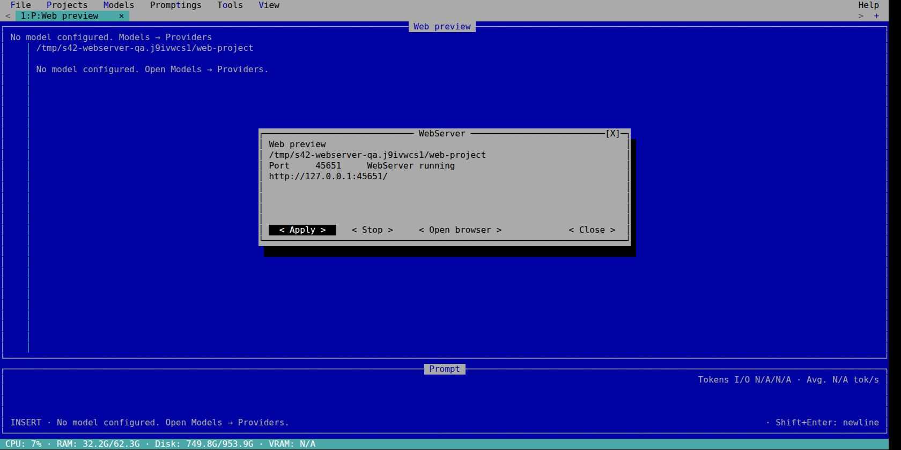

# QA — WebServer del proyecto

Fecha: 2026-10-01. Bun 1.4.2, TypeScript 7.0.2, Linux x64.
Implementación: src/system/webserver.ts, src/ui/webserver.ts y ciclo de vida App.
Todo se probó con carpetas/configuraciones temporales; no se usó la config personal.

## Validación automatizada

- `bun run typecheck`: correcto.
- `bun test tests/webserver.test.ts tests/internal-tools.test.ts`: 12 pass / 0 fail.
- `bun test`: **172 pass / 0 fail**, 36 archivos, 3032 assertions, 19.34 s.

Los cinco tests nuevos comprueban tráfico HTTP real con Bun.serve:

1. HTML con MIME, CSS/JS, imagen PNG con bytes exactos, HEAD sin cuerpo y rango
   206, index en subcarpeta, redirect con query y listado con enlaces Unicode,
   espacios, `&` y `#`. Refresh ve el archivo modificado. 404/400/405 y raíz
   respetada incluso para symlink hacia afuera.
2. Proyectos separados; puertos inválidos/ocupados, idempotencia, cambio de
   puerto conservando anterior ante error y cierre con conexión rechazada.
3. Tools → WebServer, Enter, archivo activo, ES/EN, borrador conservado, resize
   100×32/60×16, botones sin superposición, dos servidores y cierre por proyecto,
   cambio de carpeta y salida. El opener está sustituido en memoria en este caso.
4. Fallo del opener deja error/URL y servidor disponible para detener/reintentar.
5. `index.ts` real en Bun.Terminal abre el menú, configura puerto e inicia. Un
   xdg-open temporal registra argv: Bun Shell entrega la URL exacta. Resize,
   salida 0, restauración ANSI y puerto cerrado. No usa un navegador en ese test.

Se corrigió durante QA que deshabilitar controles durante la operación cambiaba
el foco a Cerrar: ahora vuelve al control de origen y se puede corregir el puerto.
En 60 columnas se reducen los anchos de Iniciar/Detener para conservar separados
Abrir navegador y Cerrar. El test anterior del catálogo buscaba el primer item
ordinal de Tools; ahora busca “Nativas · catálogo”, conservando su cobertura.
La primera suite completa dio 171 pass/1 fail por ese ordinal; la corrida final
arriba confirma su corrección.

## Interacción real TUI → navegador

`index.ts` se ejecutó desde la fuente en un Bun PTY, mostrado sin recrear la UI
por xterm.js 6.0.0 en Chrome. Control mediante teclado y clic del emulador;
Bun Shell ejecutó el xdg-open real del escritorio. Config SQLite y proyecto
HTML/CSS/JS/SVG temporales en `/tmp/s42-webserver-qa.j9ivwcs1/`.

- Alt+O → Enter abrió WebServer, puerto inicial 3000 y proyecto “Web preview”.
- Campo de puerto 45651 → Iniciar abrió automáticamente una pestaña de Chrome
  en `http://127.0.0.1:45651/`, con título “S42 WebServer QA”.
- El navegador mostró “HTML + CSS + JavaScript loaded”, SVG visible y estilo
  CSS azul DOS (`rgb(0, 0, 170)`). Imagen renderizada con ancho 100 px.
- Clic en “Test JavaScript” produjo “JavaScript click works”.
- Clic en Detener desde la TUI dejó el endpoint con conexión rechazada.
- Se reinició el entrypoint tras el ajuste final de layout, se inició de nuevo
  mediante clic y se capturó la ventana final. El cierre de QA detuvo el servidor.

Las capturas son JPEG originales del navegador, sin generación de imagen,
montajes ni modificaciones de píxeles:

## Límites de esta evidencia

Apertura real del navegador comprobada en Linux. Implementadas las ramas Bun
Shell para macOS (`open`) y Windows (`cmd.exe /c start`); su runtime queda pendiente.
Servidor estático: no bundler, transpiling, hot reload ni backend de framework.
La compatibilidad de cada formato depende del navegador. Puertos/servidores son
estado de ejecución y no se inician automáticamente al reabrir la aplicación.
Sin modelos LLM, builds, nuevos benchmarks ni publicación externa en esta tarea.

La edición ajena de docs/qa/final-validation.md se preservó fuera del commit.
Un driver de capturas anterior estaba bajo out/ con extensión .ts y participaba
del typecheck global: se conservó como .ts.txt en ese directorio ignorado.
Los drivers nuevos siguen fuera del repositorio, en /tmp.
