# S42 Agent — real screenshot gallery

**35 original screenshots: 28 new captures and 7 preserved from earlier QA.**
Click a thumbnail to open the full-size JPEG. [English README](../README.md) ·
[README en español](../README.es.md) · [Capture manifest](manifest.json).

These are real executions of the root `index.ts`, not UI mockups. Bun.Terminal
runs the agent in a PTY; xterm.js displays its original ANSI output in Chrome.
The browser viewport images are saved unchanged: no generated pixels, overlays,
retouching or cropping. They are terminal-emulator captures, not native desktop
window screenshots.

New captures 08–35 use source commit `494b9f34293448594ef02be3ef1c649db75423a5`,
Bun 1.4.2 and a temporary SQLite configuration on Linux x64. The “Web Playground”
project and three prompting templates are sample input data for this tour,
not preinstalled projects or templates. Personal configuration and credentials
were not used.

Screenshots 08 and 10 show **GLM-4.7-Flash on local llama.cpp**, with a real `read`
call and completed answer. Token counts and tok/s belong to that one run;
these screenshots are not a benchmark or evidence of a completed coding task.
Screenshot 27 shows the actual skills.sh results for `pdf`; no skill was installed.
MCP and skill registration images show real configuration forms, not a connected
MCP server or an installed external skill.

## The workspace and agent

<table>
  <tr>
    <td><a href="08-live-agent-activity.jpg">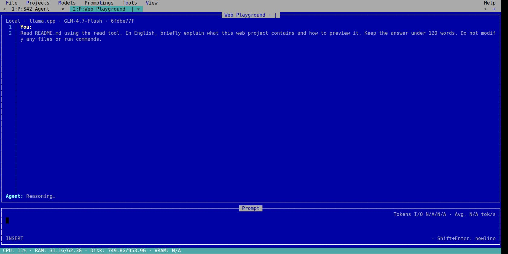</a> <strong>Live agent activity in the project tab and chat</strong></td>
    <td> <strong>Real read tool call, response and token metrics</strong></td>
  </tr>
  <tr>
    <td> <strong>QBasic · TypeScript, line numbers and P:/F: tabs</strong></td>
    <td> <strong>Dracula · TypeScript</strong></td>
  </tr>
</table>

## Files and browser preview

<table>
  <tr>
    <td> <strong>Browse the current repository</strong></td>
    <td><a href="15-file-search.jpg">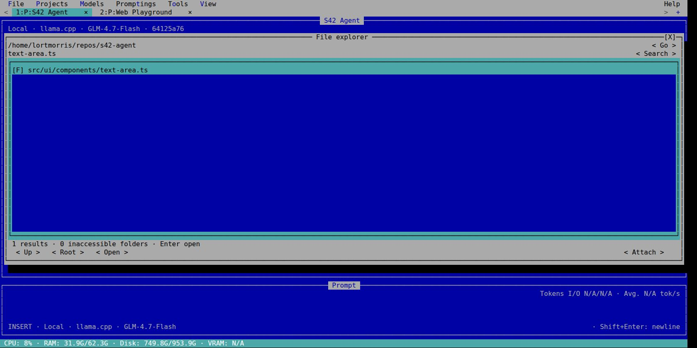</a> <strong>Find text-area.ts by filename</strong></td>
  </tr>
  <tr>
    <td> <strong>WebServer running for a project</strong></td>
    <td><a href="07-browser-preview.jpg">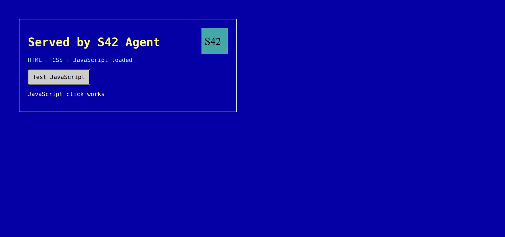</a> <strong>HTML, CSS, JavaScript and SVG in the browser</strong></td>
  </tr>
</table>

## Reusable promptings

<table>
  <tr>
    <td><a href="11-prompting-library.jpg">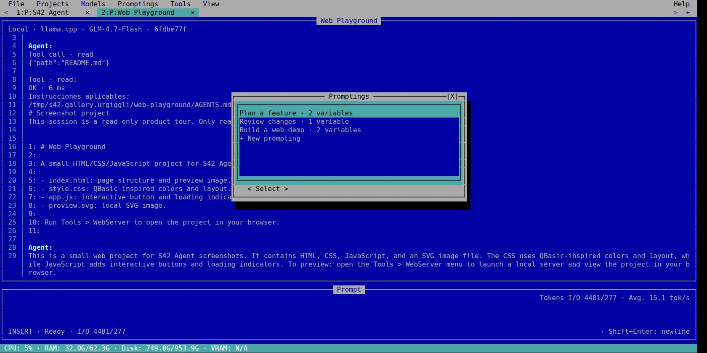</a> <strong>Reusable prompting library</strong></td>
    <td> <strong>Fill a prompting metavariable</strong></td>
  </tr>
  <tr>
    <td><a href="13-prompting-editor.jpg">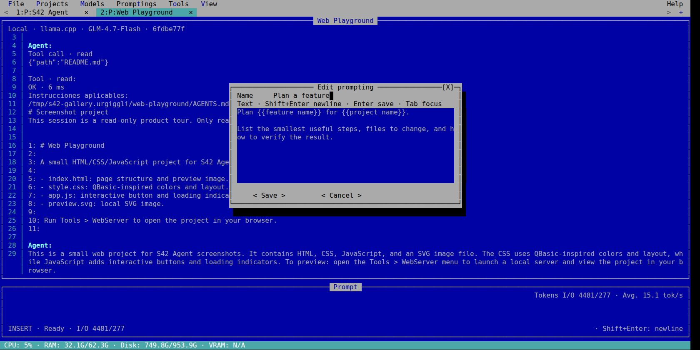</a> <strong>Edit a template with {{variables}}</strong></td>
  </tr>
</table>

## Projects, models and extensions

<table>
  <tr>
    <td><a href="29-project-configuration.jpg">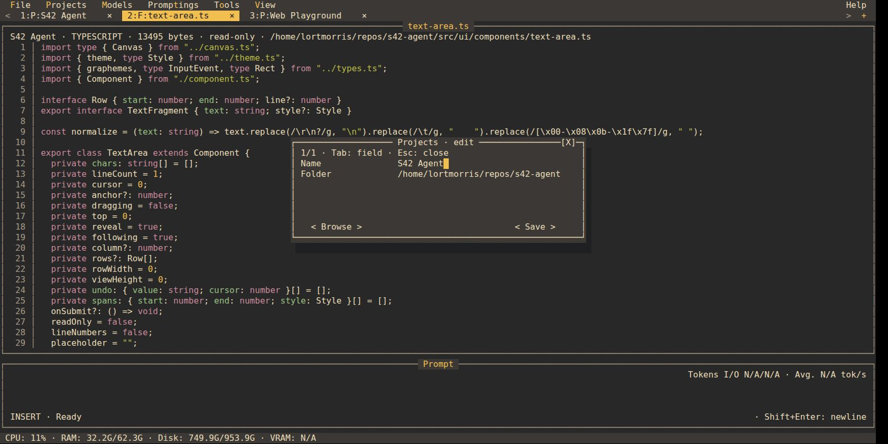</a> <strong>Project configuration · Name and Folder</strong></td>
    <td> <strong>llama.cpp and DeepSeek provider presets</strong></td>
  </tr>
  <tr>
    <td><a href="30-model-configuration.jpg">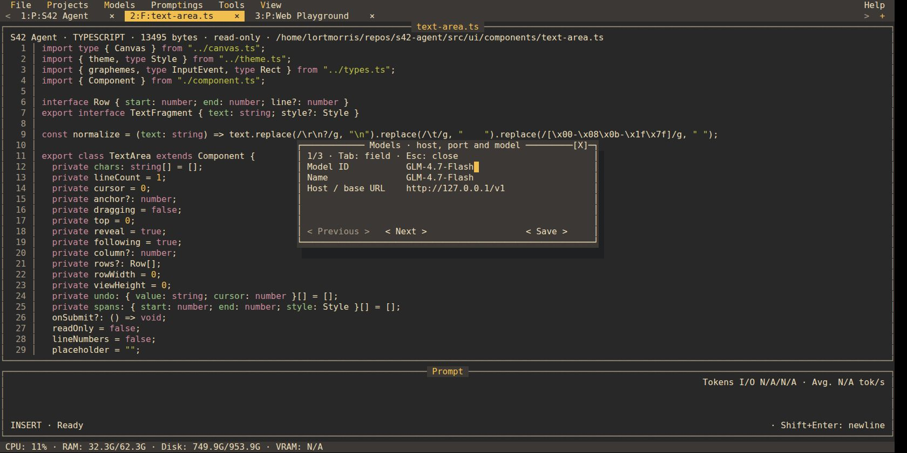</a> <strong>Model configuration · ID, name and host</strong></td>
    <td><a href="22-tools-menu.jpg">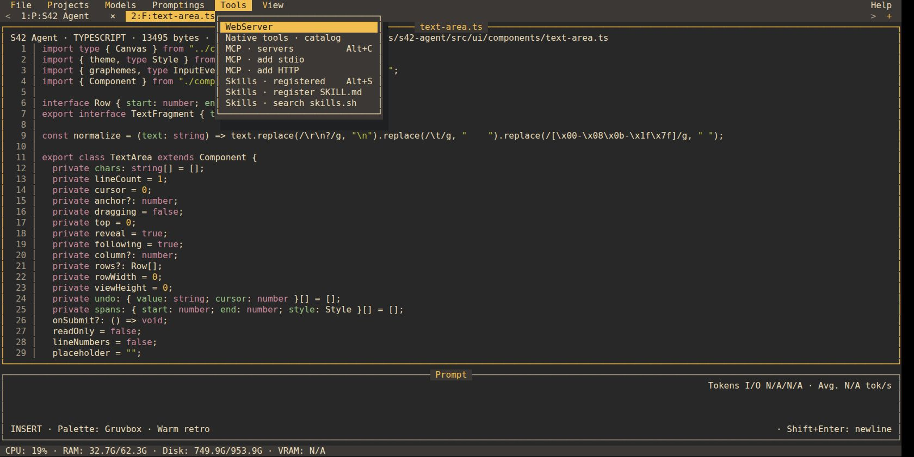</a> <strong>Tools menu · WebServer, native tools, MCP and skills</strong></td>
  </tr>
  <tr>
    <td><a href="23-native-tools.jpg">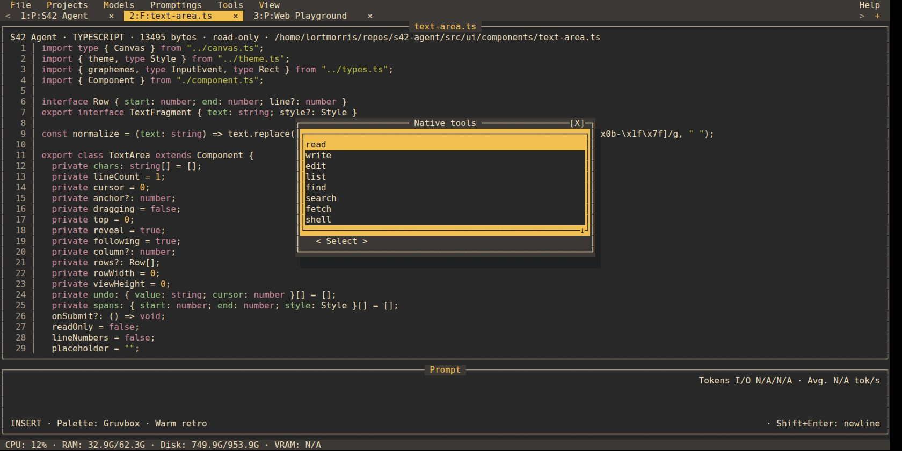</a> <strong>Native file, HTTP and shell tools</strong></td>
    <td><a href="24-native-web-tools.jpg">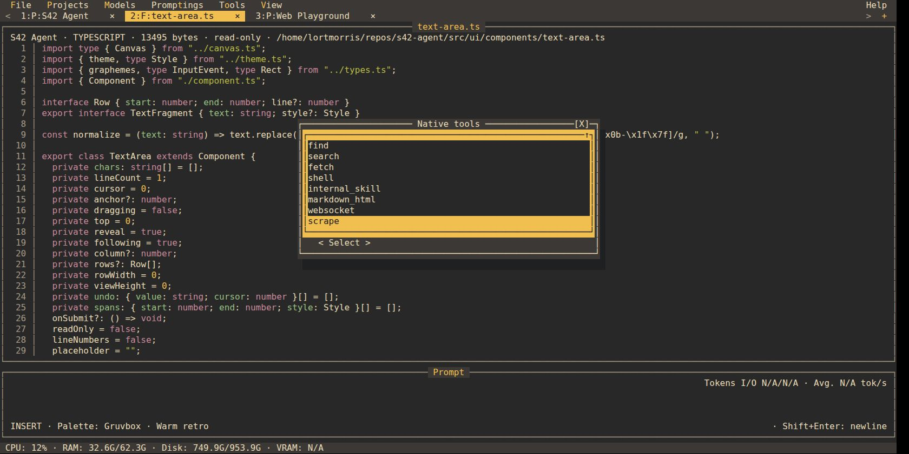</a> <strong>Internal skills, Markdown, WebSocket and scraping</strong></td>
  </tr>
  <tr>
    <td><a href="25-mcp-stdio-configuration.jpg">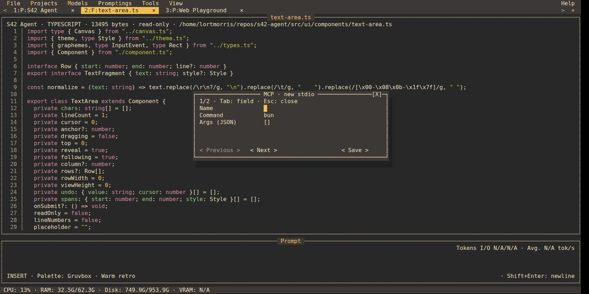</a> <strong>MCP stdio configuration form</strong></td>
    <td><a href="26-skills-search.jpg">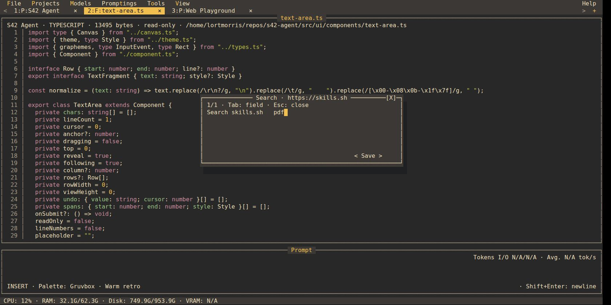</a> <strong>Search form · https://skills.sh</strong></td>
  </tr>
  <tr>
    <td> <strong>Live results from skills.sh</strong></td>
    <td><a href="28-skill-registration.jpg">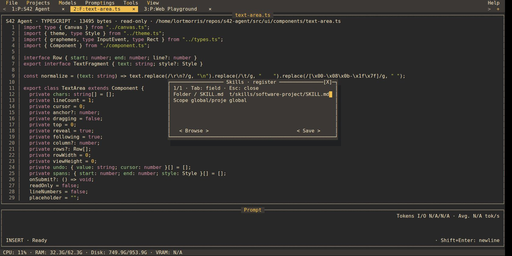</a> <strong>Register a real SKILL.md path</strong></td>
  </tr>
</table>

## Six color themes

<table>
  <tr>
    <td> <strong>QBasic · TypeScript, line numbers and P:/F: tabs</strong></td>
    <td> <strong>Graphite · TypeScript</strong></td>
  </tr>
  <tr>
    <td> <strong>Forest · TypeScript</strong></td>
    <td> <strong>Nord · TypeScript</strong></td>
  </tr>
  <tr>
    <td> <strong>Dracula · TypeScript</strong></td>
    <td> <strong>Gruvbox · TypeScript</strong></td>
  </tr>
</table>

## English and Spanish

<table>
  <tr>
    <td><a href="31-language-selection.jpg">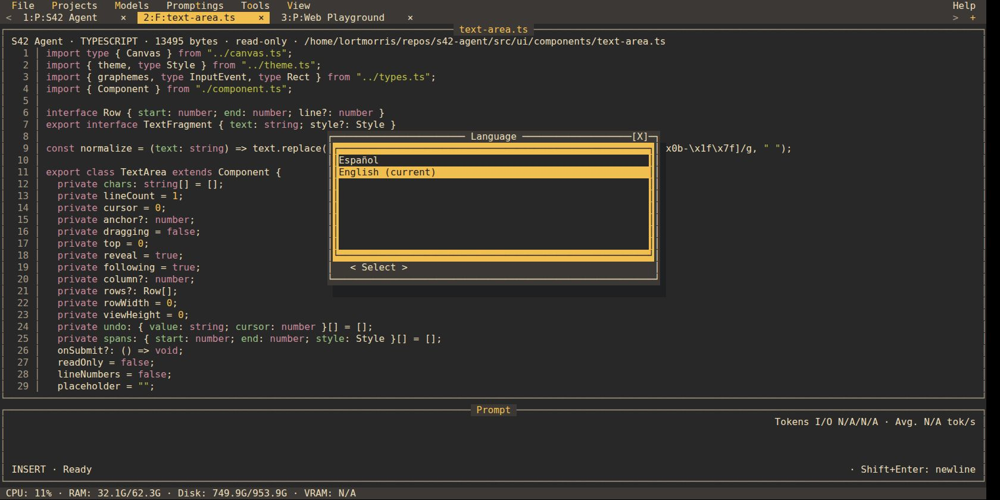</a> <strong>English and Spanish language selector</strong></td>
    <td> <strong>Spanish UI · Gruvbox</strong></td>
  </tr>
  <tr>
    <td><a href="33-about-spanish.jpg">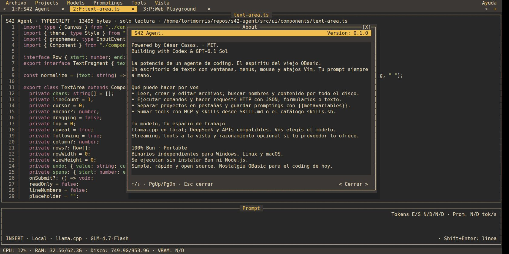</a> <strong>About · Spanish · Gruvbox</strong></td>
    <td><a href="34-theme-selector-spanish.jpg">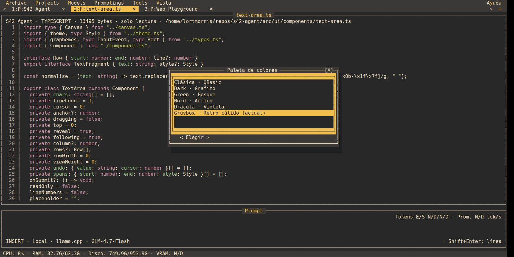</a> <strong>Six themes · Spanish selector</strong></td>
  </tr>
  <tr>
    <td><a href="35-keyboard-help-spanish.jpg">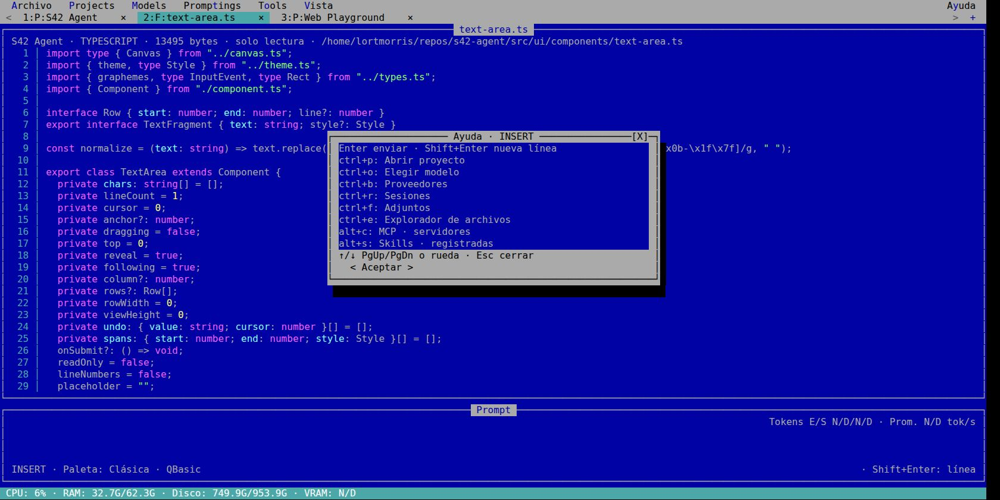</a> <strong>Keyboard help · Spanish · QBasic</strong></td>
  </tr>
</table>

## Preserved earlier captures

Files 01–05 preserve the original line-number captures; files 06–07 preserve
an earlier WebServer/browser run. The JPEGs here remain byte-identical to those
captures. Duplicate image directories and internal QA reports are archived
locally outside Git. Older images may show an earlier menu or tab presentation.

<table>
  <tr>
    <td><a href="01-qbasic-chat.jpg">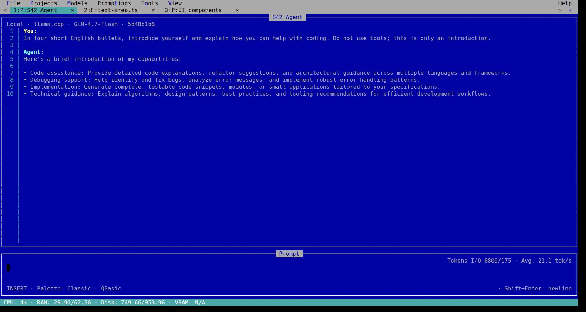</a> <strong>Local-model chat · QBasic</strong></td>
    <td><a href="02-file-explorer.jpg">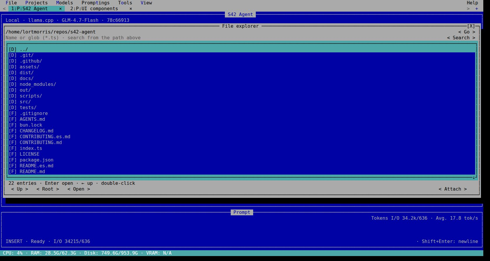</a> <strong>File explorer · original capture</strong></td>
  </tr>
  <tr>
    <td><a href="03-typescript-file.jpg">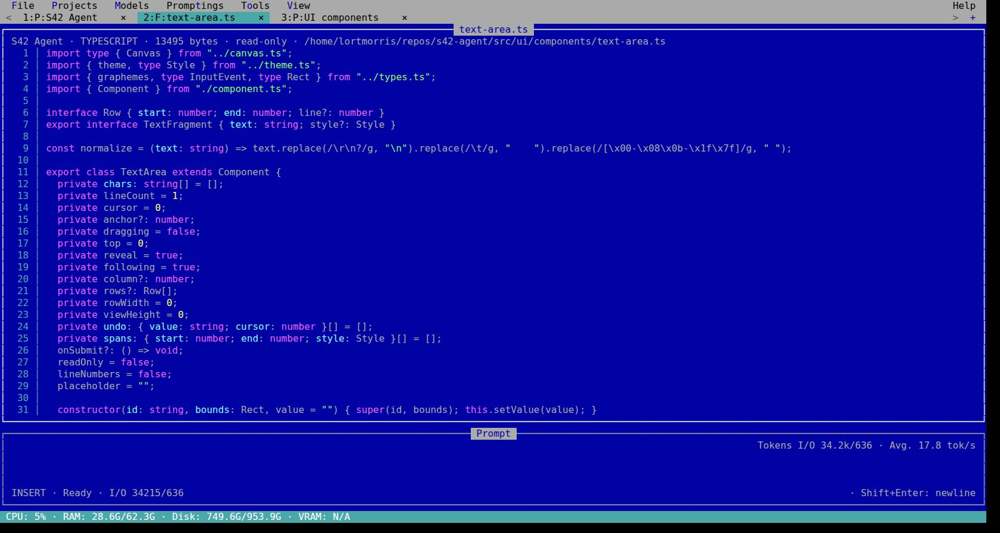</a> <strong>Numbered TypeScript · original capture</strong></td>
    <td> <strong>Theme selector · original capture</strong></td>
  </tr>
  <tr>
    <td> <strong>About · English · Nord</strong></td>
  </tr>
</table>

## Capture details

- JPEG viewport sizes: 1680×841 for new captures; original images retain their dimensions.
- Emulator: xterm.js 6.0.0 with fit addon 0.11.0, DejaVu Sans Mono 16 px, line height 1.1.
- Keyboard and mouse interactions use the running TUI's menus, forms and file explorer.
- All six palettes and both UI languages were selected through the TUI.
- The agent closed normally with exit code 0; the temporary capture server was stopped.
- [manifest.json](manifest.json) records every file's dimensions, bytes, SHA-256 and source batch.

No binary builds, new benchmarks or Windows/macOS runtime validation were performed.
